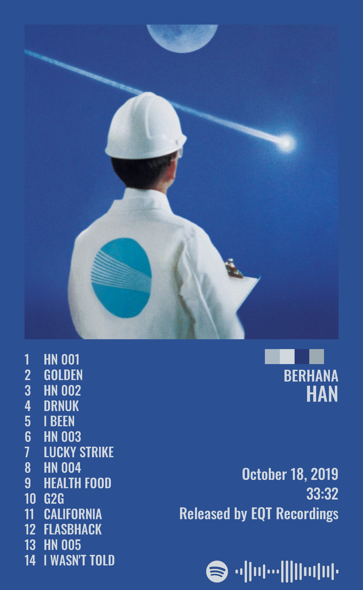
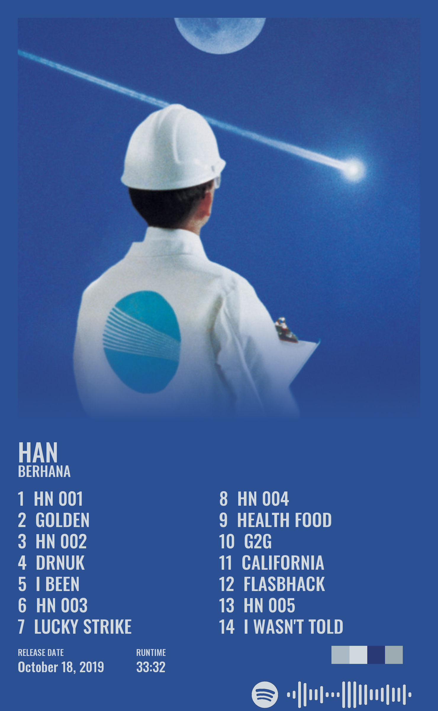
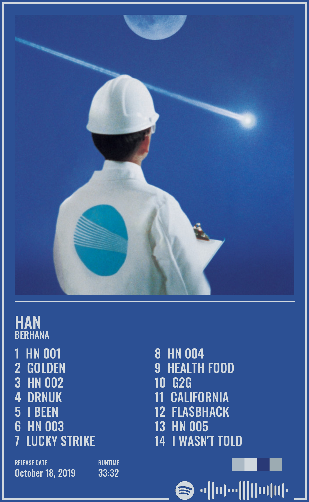
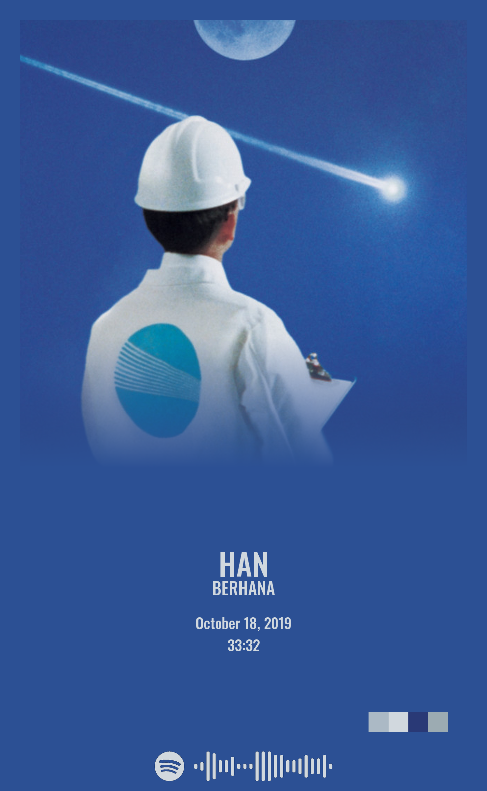
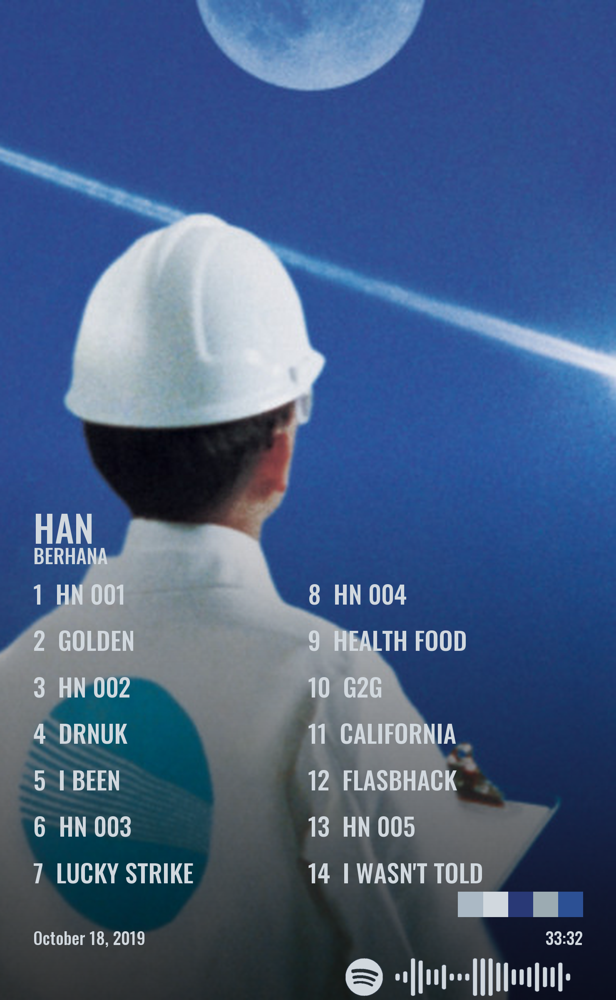

# Album Poster

[](https://album.hxr.life/)
[](https://github.com/H-Bombmxpwr/MusicPoster)

An open-source tool that transforms any album on Spotify into a print-ready poster. Search by album name, or paste a Spotify URL, and Album Poster fetches the artwork, tracklist, and metadata to generate a professional-quality poster in seconds.

Each poster includes:

- High-resolution album cover art
- Full tracklist (up to 50 tracks)
- Artist name and album title
- Release date
- Total runtime
- Record label
- A scannable Spotify code linking to the album

---

## Poster Styles

Five distinct poster layouts are available, inspired in part by [Posterfy](https://github.com/avictormorais/posterfy) by avictormorais.

All examples below show **HAN** by **Berhana** ([Spotify](https://open.spotify.com/album/0dYLggTkorgK9OV4IgrBin)).

| Classic | Standard | Frame | Basic | Full Cover |
|:-------:|:--------:|:-----:|:-----:|:----------:|
|  |  |  |  |  |

---

## Customization

After generating a poster you can fine-tune it on the edit screen:

- **Colors** -- pick background and text colors manually, or choose from palette suggestions extracted from the album art.
- **Text** -- override the artist name, album title, release date, label, and individual track names.
- **Tracklist formatting** -- toggle tabulated alignment and dotted track numbers.
- **Truncation control** -- for the Classic style, a per-track toggle lets you enable or disable automatic text truncation.
- **Album art** -- supply a custom cover image URL.
- **Download options** -- export as high-resolution PNG at configurable DPI.

---

## Website

Create your own posters at [album.hxr.life](https://album.hxr.life/). Type an artist and album name to get started -- suggestions autofill as you type. Pasting a Spotify album URL into the album field will always work.

### Surprise Me

Not sure where to start? The **Surprise Me** button on the homepage generates a poster from a random album.


### Community Gallery

Browse hundreds of community-submitted and generated posters on the [Mosaic](https://album.hxr.life/mosaic) page.

---

## Local Development

### Requirements

- **[uv](https://docs.astral.sh/uv/getting-started/installation/)** — Python toolchain and package manager
- A Spotify Developer application with a Client ID and Client Secret

### Setup

1. Clone the repository.

2. Install uv if you don't have it:

   ```bash
   # macOS / Linux
   curl -LsSf https://astral.sh/uv/install.sh | sh

   # Windows
   powershell -ExecutionPolicy ByPass -c "irm https://astral.sh/uv/install.ps1 | iex"

   # or via Homebrew
   brew install uv
   ```

3. Create a Spotify app at [developer.spotify.com](https://developer.spotify.com/) and note your Client ID and Client Secret.

4. Copy `keys.env.example` to `keys.env` and fill in your credentials:

   ```
   SPOTIPY_CLIENT_ID='your_id'
   SPOTIPY_CLIENT_SECRET='your_secret'
   SPOTIPY_REDIRECT_URI='http://localhost:5000/callback' #Not needed unless you want login with spotify
   FLASK_SECRET_KEY='any-random-secret'
   ```

5. Install dependencies (uv creates the virtual environment automatically):

   ```bash
   uv sync
   ```

### Running

**Web app:**

```bash
uv run python app.py
```

**CLI** -- generate a poster without a server. Edit the artist and album variables in `local.py` then run:

```bash
uv run python local.py
```

---

## Printing

Posters generated by this tool may contain copyrighted material. Printing and reselling them may have legal implications. Proceed at your own discretion.

---

## Acknowledgments

- **Noah Sprovieri** and **Katie Ulinski** for graphic design support.
- **[Posterfy](https://github.com/avictormorais/posterfy)** by avictormorais for inspiring the Standard, Frame, Basic, and Full Cover poster styles.
- Everyone who has submitted posters or contributed code to the project.
